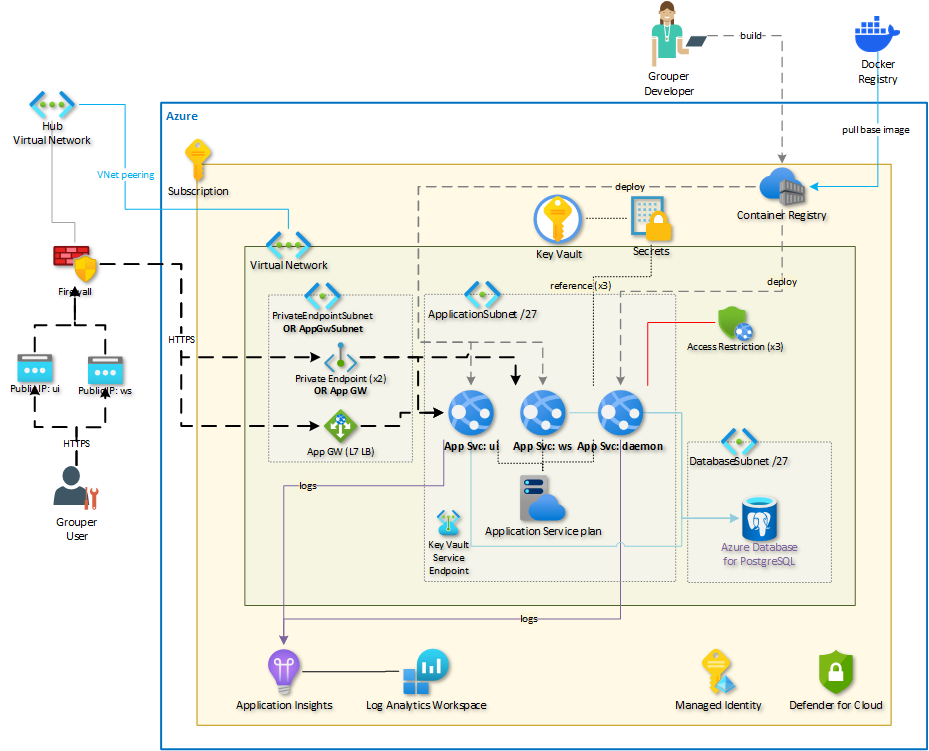

# Grouper On Azure PaaS

Deploys Azure infrastructure required to run InCommon Grouper in Azure using platform services.

## Purpose

InCommon Grouper is a popular group and access management system used by many organizations. The purpose of this project is to deploy the necessary Azure infrastructure to run InCommon Grouper on Azure using platform services while demonstrating best practices for platform services. By leveraging Azure's PaaS offerings, we can take advantage of the scalability, reliability, and security features provided by Azure.

The architecture of this deployment will be explained in detail in the upcoming sections. It will cover the various Azure services that will be utilized, such as App Service, Azure Database for PostgreSQL Flexible Server, Container Registry, Key Vault, Log Analytics Workspace, Application Insights, and Managed Identity. Each of these services plays a crucial role in ensuring the smooth operation of InCommon Grouper on Azure.

In order to deploy this project, please refer to the upcoming section on deployment. It will provide step-by-step instructions on how to set up the required Azure resources and configure them for running InCommon Grouper. Additionally, there will be considerations for production environments, such as best practices for managing the PostgreSQL database, deploying multiple instances for resiliency, and optimizing the compute resources for both PostgreSQL and the App Service Plan.

## Architecture

*[Download Visio](docs/architecture.vsdx)*

## Azure Services

- App Service
- Azure Database for PostgreSQL Flexible Server
- Container Registry
- Key Vault
- Log Analytics Workspace
- Application Insights
- Managed Identity

## Deployment

Coming soon.

### Considerations for production

- Do not use the PostgreSQL database administrator account for Grouper. Create a database user with the right permissions instead. After doing so, update the secrets in Key Vault and restart the App Services.
- Deploy multiple instances for resiliency.
- Review the compute for PostgreSQL and App Service Plan to make sure it meets your needs.
- Enable continuous deployment of the container to the three App Services. Practice safe deployment using Deployment Slots.
- Consider deploying Azure Front Door or Application Gateway to secure the app with a Web Application Firewall (WAF). Application Gateway (or ingress via a Firewall) are included on the diagram but are not included in the Bicep code.
- Enhance the Grouper container image with custom configuration, e.g., for Shibboleth support.
- Protect the Azure Container Registry using private endpoints.
- When peering to your hub network, ensure that the PostgreSQL Flexible Server is registered in the correct private DNS zone. If needed, set custom DNS server IP addresses in the virtual network configuration.
